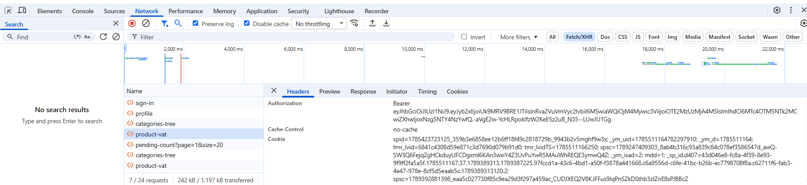

pip install openpyxl requests

python run.py

как найти токен:

заходим на нужный сервис (белка, консоль псбм или кабинет администратора), жмем f12, network, fetch/xhr, выбираем запрос (name) и в заголовках (headers) ищем X-Access-Token или Authorization

